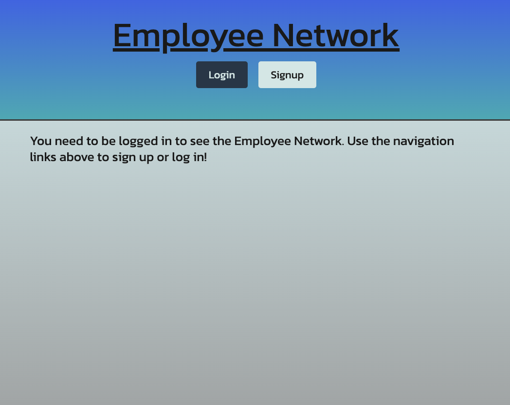
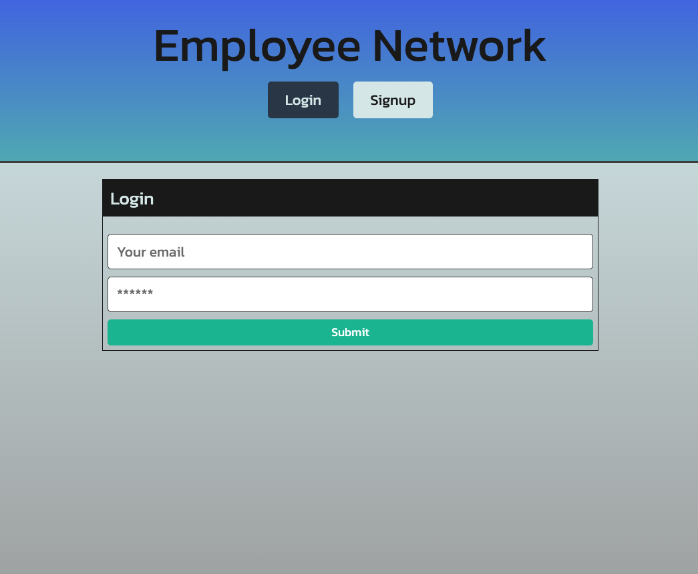
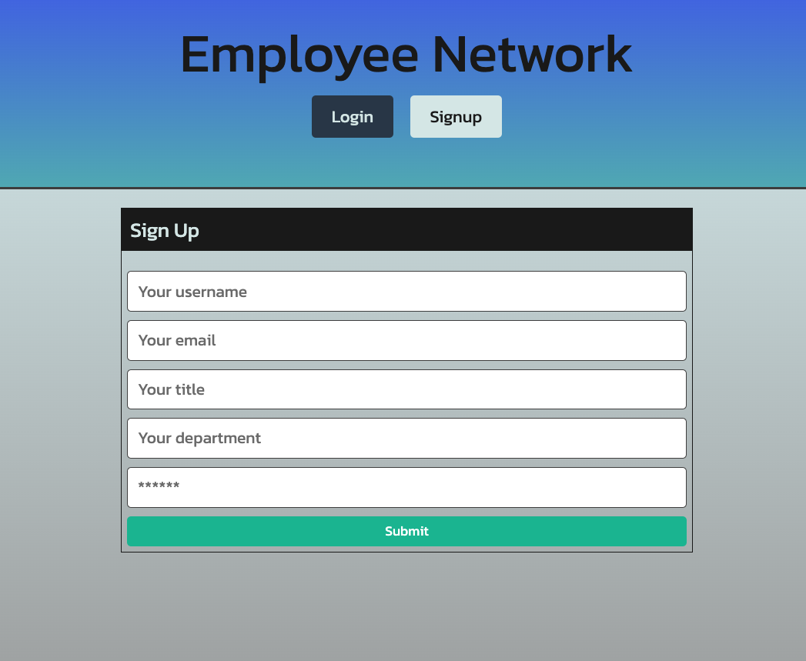
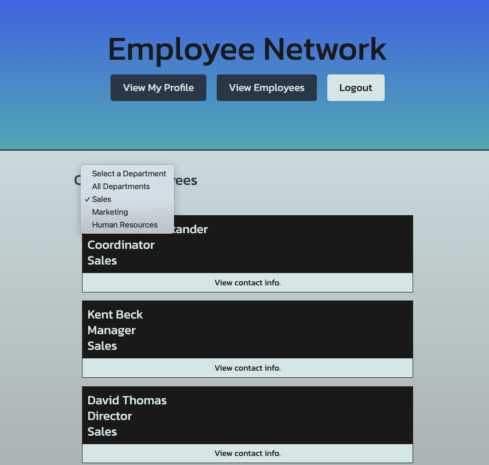

# Employee Network

Welcome to the Employee Network site! Please create an account to log in and access information on all employees in our company.  Each employee profile has their name, title, department, and email, as well as a headshot.

### Table of Contents
- [User Story](#User-Story)
- [Technologies Used](#Technologies-Used)
- [Screenshots](#Screenshots)
- [Deployed Application](#Deployed-Application)
- [GitHub Repository](#GitHub-Repository)
- [Future Development](#Future-Development)
- [Authors](#Authors)

### User Story

```md
AS AN employee of a large company
I WANT an employee tracker to view all the employees in my company and their info
SO THAT I can easily reference and collaborate with other employees  
```

### Technologies Used

* React for the front end.
* GraphQL with a Node.js and Express.js server.
* MongoDB and the Mongoose ODM for the database.
* Use queries and mutations for retrieving, adding, updating, and deleting data.
* Deployed with Heroku.
* JWT Authentication
* Protect sensitive API key information on the server.

### Screenshots

* Landing Page


* Login Page


* Sign Up Page


* Employee List Page


### Deployed Application

* [Click here for the deployed application]()

### GitHub Repository

* [Click here for the GitHub Repo](https://github.com/chrisnastro/third_group_project)

### Future Development

* Ability for user to update their title, department, and profile picture.

### Authors

- [William Hunter](https://github.com/hunterwilliam795)
- [Ashley Maximillian](https://github.com/e6m9)
- [Chris Nastro](https://github.com/chrisnastro)
- [Justin Ramirez](https://github.com/justinravenwolfe)

© 2024 edX Boot Camps LLC. Confidential and Proprietary. All Rights Reserved.
